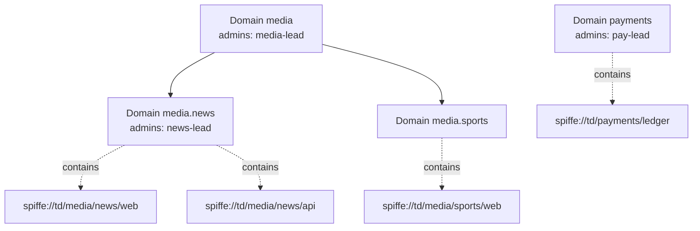
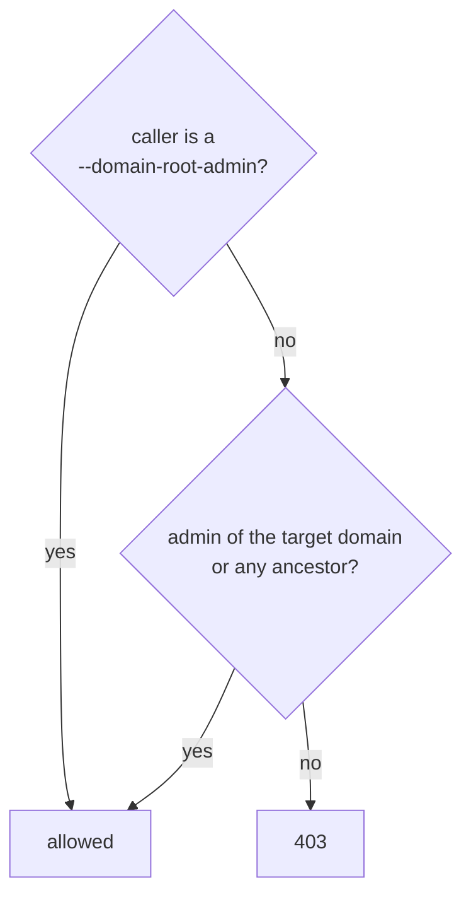
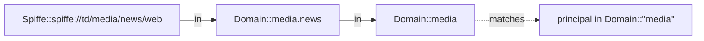

# Domains: a delegated namespace that policies can use

Domains are Omega's namespace for SPIFFE IDs. They form a tree (`media` → `media.news`), each domain has its own admins, and the tree is visible to Cedar policies, so one rule can cover every workload a team owns. The design decision is [ADR 0014](adr/0014-domain-hierarchy-and-delegation.md).

## The tree and the SPIFFE IDs under it



A domain name is dot-separated lowercase labels. A SPIFFE ID in the local trust domain belongs to the deepest domain whose labels prefix its path: `spiffe://td/media/news/web` is in `media.news`, and through it in `media`. A federated peer's SPIFFE ID is never in a local domain, and paths are matched case-sensitively, so `/Media/web` is in no domain. A parent must exist before its child, and a domain with children cannot be deleted.

## Who may do what

Under `--require-auth`, a principal administers a domain if it is an admin of that domain or of any domain above it, or if it is a `--domain-root-admin`.



| Operation | The caller must administer |
| --- | --- |
| Create a top-level domain | (root admins only) |
| Create `media.news` | `media` |
| Delete `media.news` (no children) | `media` |
| Grant or revoke an admin on `media.news` | `media.news` |

When a domain is created without `admins`, the authenticated caller becomes its admin. Revoking a principal on `media` removes that grant only; a grant it holds on `media.news` is separate and stays until revoked there.

Without `--require-auth`, domain writes are open, like every other write.

## Using domains in policy

Each domain is a Cedar entity `Domain::"<name>"` whose parent is its parent domain, and every `Spiffe` principal or resource is placed in its domain. So a policy can say "anything in media may read media resources":

```text
permit (
  principal in Domain::"media",
  action == Action::"read",
  resource in Domain::"media"
);
```



New domains are picked up without a restart: the server reloads the tree after each domain write and every five seconds.

Two things to keep in mind when writing policies. A `Domain::"..."` entity declared in `entities.json` replaces the projected one, so declaring it there can cut the chain to its ancestors. And because an admin of `media` may delete the leaf `media.news`, a central `forbid (principal in Domain::"media.news", ...)` stops matching once that domain is gone; write such rules against a domain the delegated admins cannot delete, or against the SPIFFE ID path itself.

## Walkthrough

```bash
# The platform team bootstraps the top level.
omega domain create media --admin spiffe://td/people/media-lead

# The media lead delegates news to its own lead.
omega domain create media.news --admin spiffe://td/people/news-lead

# The news lead manages its own subtree.
omega domain admins add media.news spiffe://td/people/news-oncall
omega domain create media.news.web

# Revoke, and clean up a leaf.
omega domain admins remove media.news spiffe://td/people/news-oncall
omega domain delete media.news.web
```

The Kubernetes operator takes the same fields: `OmegaDomain.spec.admins` sets a domain's admins when it is created, and the parent `OmegaDomain` must exist (the child retries until it does). The operator calls Omega with its own identity, so anyone allowed to create `OmegaDomain` objects in Kubernetes acts with the operator's domain authority; gate that with Kubernetes RBAC.

Every create, delete and admin change, and every refused attempt, is written to the audit chain (`domain.create`, `domain.delete`, `domain.admin.add`, `domain.admin.remove`) with the caller as actor. Under `--require-auth`, `GET /v1/domains` returns the `admins` lists only to authenticated callers.
