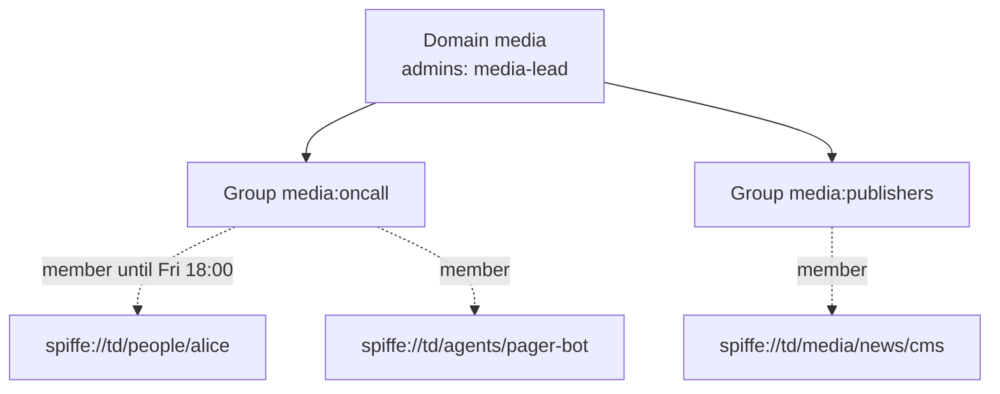
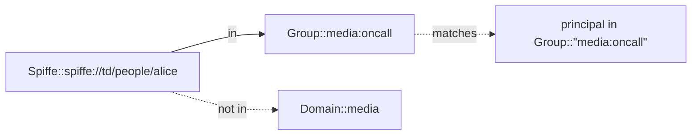
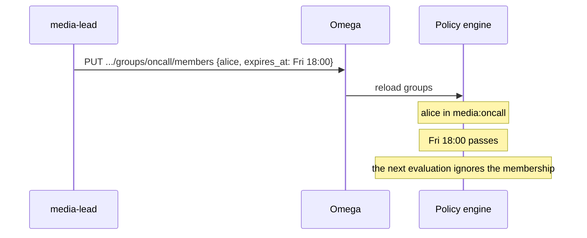

# Groups: named, delegated, time-bound sets of principals

A group is a named set of SPIFFE IDs owned by a domain. Policies refer to it as `Group::"<domain>:<name>"`, the domain's admins manage it, and a membership can end on its own at a set time. The design decision is [ADR 0015](adr/0015-groups-with-expiring-membership.md); domains and their admins are described in [domains.md](domains.md).

## Where groups sit



A group belongs to exactly one domain, and that domain's admins (or the admins of any domain above it) create it, delete it and change its members. Members can be any SPIFFE ID. A domain that still owns groups cannot be deleted.

## Using groups in policy

```text
permit (
  principal in Group::"media:oncall",
  action == Action::"page",
  resource
);
```

A group is not inside its domain: being in `media:oncall` does not make a principal `in Domain::"media"`. Use both when a rule needs both.



## Time-bound membership



`expires_at` is checked each time a request is evaluated, so access ends at that moment on every replica, with no refresh involved. The membership row stays until someone removes it or re-adds the member with a new expiry.

## Walkthrough

```bash
omega group create media oncall --description "Media on-call rotation"
omega group members add media oncall spiffe://td/agents/pager-bot
omega group members add media oncall spiffe://td/people/alice --expires-in 72h
omega group get media oncall
omega group members remove media oncall spiffe://td/agents/pager-bot
```

| Endpoint | Purpose |
| --- | --- |
| `GET /v1/domains/{name}/groups` | List a domain's groups |
| `POST /v1/domains/{name}/groups` | Create a group |
| `GET /v1/domains/{name}/groups/{group}` | Show a group and its members |
| `DELETE /v1/domains/{name}/groups/{group}` | Delete a group and its memberships |
| `PUT /v1/domains/{name}/groups/{group}/members` | Add a member, or change its expiry |
| `DELETE /v1/domains/{name}/groups/{group}/members?principal=...` | Remove a member |

Every change, and every refused attempt, is audited (`group.create`, `group.delete`, `group.member.add`, `group.member.remove`). Under `--require-auth` the member lists are returned only to authenticated callers. A change made on one replica reaches the others within five seconds.
