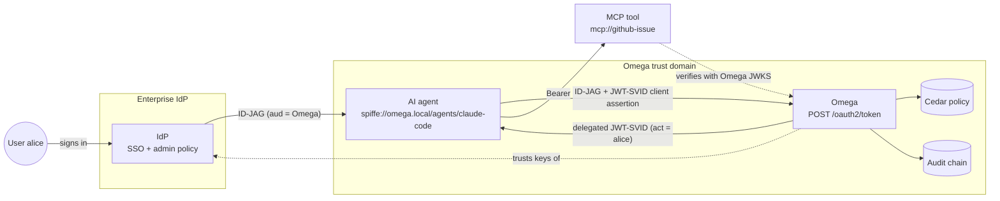
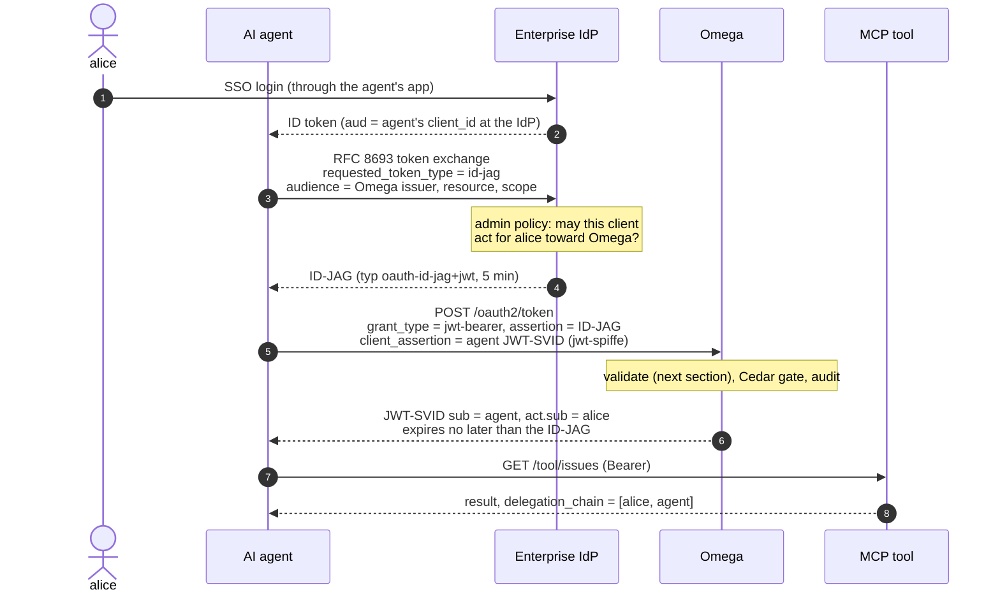
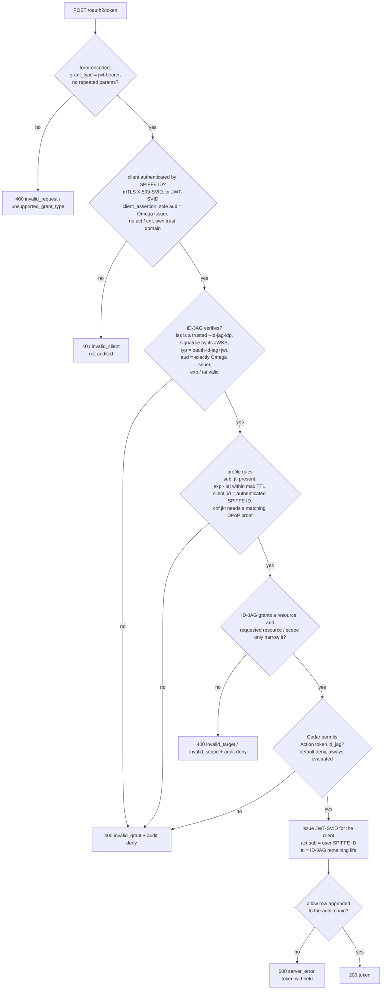
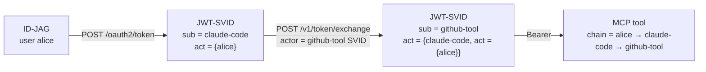
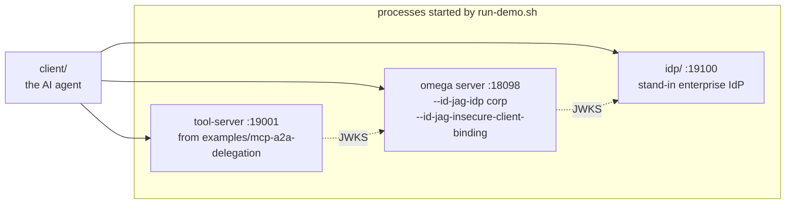

# ID-JAG: letting an enterprise IdP authorize an AI agent

This page explains how Omega accepts an Identity Assertion JWT Authorization Grant (ID-JAG) and turns it into a delegated JWT-SVID, and walks through the runnable demo in [`examples/id-jag/`](../examples/id-jag/). The design decision and its trade-offs are recorded in [ADR 0011](adr/0011-id-jag-authorization-grant.md).

## The problem

An AI agent acting for a user needs a token for a tool. Two parties have a say:

1. **The user's enterprise IdP** knows who the user is and decides which apps may act for them. Admins already manage that policy there.
2. **Omega** owns the agent's workload identity (its SPIFFE ID), the AuthZEN policy for the tool, and the audit trail.

Without a standard handoff, the agent either gets a broad long-lived credential or every tool runs its own consent flow. ID-JAG ([draft-ietf-oauth-identity-assertion-authz-grant](https://datatracker.ietf.org/doc/draft-ietf-oauth-identity-assertion-authz-grant/)) is the handoff: the IdP signs a short grant saying "this client may act for this user at that authorization server", and the authorization server (Omega here) issues the actual token.

## Who trusts whom



Omega trusts the IdP only for ID-JAGs, through `--id-jag-idp`. The IdP never learns Omega's keys, and with `--require-auth` the agent never holds a credential that works without its own SPIFFE identity.

## The flow



Steps 1 to 5 happen at the IdP and are not Omega's concern. Omega's part starts at step 6, and that request is a standard RFC 7523 JWT bearer grant, not an RFC 8693 token exchange.

## What Omega checks

Every check below must pass. Once the client has authenticated, every refusal writes a `token.id_jag` deny row to the audit chain; requests that fail client authentication are only counted in the route metrics, so they cannot grow the chain. When the ID-JAG itself fails validation the client only sees `assertion could not be validated`; the reason is in the audit row, so a client cannot probe which issuers Omega trusts.



Three checks carry most of the weight:

| Check | Attack it stops |
| --- | --- |
| `typ` must be `oauth-id-jag+jwt` | Replaying the user's ID token as if it were a grant. An IdP that issues both signs them with the same key, so only explicit typing tells them apart. |
| `aud` must be exactly Omega's issuer | Redeeming at Omega an ID-JAG the IdP issued for a different authorization server. |
| `client_id` must equal the authenticated SPIFFE ID | Another workload that intercepted the ID-JAG redeeming it. The grant is bound to the agent's identity, not to possession of the token. |

## The tokens

An ID-JAG as the demo IdP issues it (header, then claims):

```json
{ "alg": "ES256", "kid": "idp-1", "typ": "oauth-id-jag+jwt" }
```

```json
{
  "iss": "http://127.0.0.1:19100",
  "sub": "alice",
  "aud": "https://omega.demo.local",
  "client_id": "spiffe://omega.local/agents/claude-code",
  "jti": "9f1c...",
  "iat": 1791635624,
  "exp": 1791635924,
  "scope": "issues:read",
  "resource": "mcp://github-issue"
}
```

The JWT-SVID Omega issues for it. The user lives in `act`, so the token is still the agent's own identity, and the tool can see on whose behalf it acts:

```json
{
  "iss": "https://omega.demo.local",
  "sub": "spiffe://omega.local/agents/claude-code",
  "aud": "mcp://github-issue",
  "scope": "issues:read",
  "act": {
    "sub": "spiffe://omega.local/humans/corp/alice",
    "kind": "id-jag",
    "idp": "corp",
    "upstream_iss": "http://127.0.0.1:19100",
    "upstream_sub": "alice",
    "jti": "9f1c..."
  },
  "exp": 1791635924
}
```

`act.sub` is rendered from the `template=` of the `--id-jag-idp` entry (`spiffe://omega.local/humans/{idp}/{sub}` in the demo). The placeholders are the same as for `--oidc-idp`, and a claim value containing `/` is rejected so it cannot forge extra path segments.

## Extending the chain

The issued JWT-SVID has the same shape as a `POST /v1/token/exchange` result, so the agent can hand work to a sub-agent with the existing endpoint. Each hop is gated and audited, and the user stays at the root:



## Configuration

```bash
omega server \
  --issuer-url https://omega.example.com \
  --require-auth --client-ca ./trust-bundle.pem --tls-cert ./server.pem --tls-key ./server-key.pem \
  --id-jag-idp 'name=corp,issuer=https://idp.example.com,template=spiffe://omega.example.com/humans/{idp}/{sub}' \
  --id-jag-max-assertion-ttl 5m \
  --policy-dir ./policies
```

| Flag | Meaning |
| --- | --- |
| `--issuer-url` | Required. An ID-JAG's `aud` must equal it, and so must the sole `aud` of a JWT-SVID client assertion. |
| `--id-jag-idp` | Repeatable. Trusts one IdP; its discovery document and JWKS are fetched on first use. One issuer per entry, and with several entries every template must contain `{idp}`. |
| `--id-jag-max-assertion-ttl` | Rejects ID-JAGs, and JWT-SVID client assertions, whose `exp - iat` is longer. Default 5m. |
| `--policy-dir` | Must contain a permit for the grant. Every grant is evaluated as `Action::"token.id_jag"` with `context.idp` and `context.requested_audience`, independent of `--enforce-token-exchange-policy`; with no permit every grant is denied, and `token.exchange` permits do not apply. |
| `--require-auth` + `--client-ca` | Required. Binds the ID-JAG to the agent: by default clients authenticate with their mTLS X.509-SVID (`spiffe_x509`). |
| `--client-cert-optional` | Optional. Also admits clients without a cert, which then authenticate with a short-lived, single-use JWT-SVID client assertion (`spiffe_jwt`), a bearer credential rather than mTLS proof of possession. Gated routes still require a client SVID. See [ADR 0012](adr/0012-optional-client-certificates.md). |
| `--id-jag-insecure-client-binding` | Development only. Lets `--id-jag-idp` start without `--require-auth`; clients then use a JWT-SVID client assertion that any caller could mint, so the binding does not hold. |

Clients discover the endpoint at `GET /.well-known/oauth-authorization-server`. The document lists the jwt-bearer grant, the `urn:ietf:params:oauth:grant-profile:id-jag` profile and every SPIFFE client authentication method this listener lets through (`spiffe_x509` with `--client-ca`, `spiffe_jwt` when connections without a certificate are admitted), but never the trusted issuers.

Without a permit the grant is refused, so a deployment ships at least one. This one, which the demo loads, lets only AI agents acting for a federated human use the grant:

```text
permit (
  principal is Spiffe,
  action == Action::"token.id_jag",
  resource is Spiffe
) when {
  principal has kind &&
  principal.kind == "ai" &&
  principal.acting_for like "spiffe://omega.local/humans/*"
};
```

## Run the demo

```bash
cd examples/id-jag
make demo
```

The demo runs without `--require-auth`, like the other examples, so it passes `--id-jag-insecure-client-binding` and the agent's JWT-SVID comes from the open `POST /v1/svid/jwt`. Expect the development warning in `server.log`. It builds and starts three processes and then runs the agent:



What each client step shows, and what the script asserts afterwards:

| Step | What happens | Expected |
| --- | --- | --- |
| 1 | alice "signs in" at the IdP | an ID token for the agent |
| 2 | the agent exchanges it for an ID-JAG addressed to Omega | `issued_token_type = ...:id-jag` |
| 3 | the agent redeems the ID-JAG with its JWT-SVID | `delegation_chain = [humans/corp/alice, agents/claude-code]` |
| 4 | the agent calls the tool | the tool echoes the same chain |
| 5 | the raw ID token is presented as the grant | `invalid_grant`; the audit row says typ is `JWT`, not `oauth-id-jag+jwt` |
| 6 | another agent presents the same ID-JAG | `invalid_grant`: `client_id` does not match |
| check | `GET /v1/audit` | one `token.id_jag` allow row and two deny rows |

`make down` stops everything and removes `/tmp/omega-id-jag-demo`.

## Limits

These follow from the draft or are deliberate. ADR 0011 explains each.

| Limit | Why |
| --- | --- |
| The issued token never outlives the ID-JAG (minutes, not the draft example's day) | Delegated authority must not outlive its grant; the client re-presents the ID-JAG or asks its IdP for a new one. |
| `jti` is required but not tracked for replay | The draft lets a client re-present the same ID-JAG until it expires. Binding to the client's SPIFFE ID is what stops theft. |
| DPoP-bound tokens need a DPoP-aware resource server | An ID-JAG bound with `cnf.jkt` is redeemed with a DPoP proof for that key, and the issued token is bound to it (`token_type: DPoP`). The resource server must verify the proof; see [ADR 0013](adr/0013-dpop-sender-constrained-tokens.md). |
| An ID-JAG without `resource` is refused | The token's audience must come from the IdP's decision, not from the client. |
| JWT-SVID client authentication needs `--client-cert-optional` in production | Under `--require-auth` the listener requires a client cert by default, so only `spiffe_x509` gets through. `--client-cert-optional` admits JWT-SVID clients too ([ADR 0012](adr/0012-optional-client-certificates.md)), at the cost of making ungated routes such as `/metrics` reachable without a cert. |
| Omega only receives ID-JAGs | Issuing them is the IdP's job; Omega is not an end-user IdP. |
| The draft is not final | Claim names may still change; this endpoint tracks the draft. |
