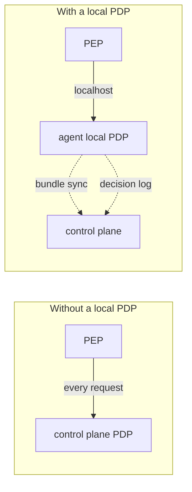
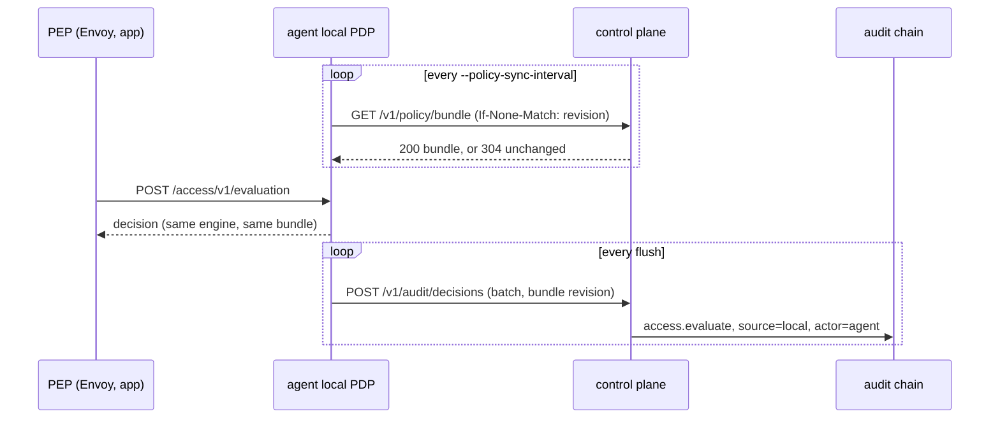
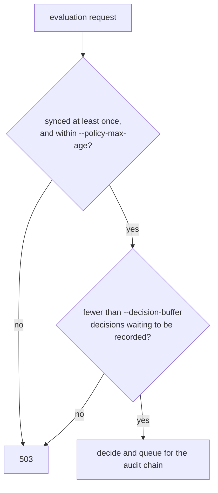

# Local policy decisions

The node agent can decide authorization requests on the node itself, from a copy of the control plane's policy, and still record every decision in the control plane's audit chain. The design decision is [ADR 0016](adr/0016-local-policy-decisions.md); the runnable demo is [`examples/local-pdp/`](../examples/local-pdp/).

## Central decisions vs local decisions

Without it, every decision is a network call to the control plane, so its latency is on every request and an outage stops all decisions. With it, decisions are local, and only the bundle sync and the decision log cross the network, off the request path.

## How it works

The bundle holds the Cedar sources, the static `entities.json`, and the domain and group directory, so a local decision is the one the control plane would make: domain placement, group membership and membership expiry (checked at evaluation time) all behave the same. A bundle whose content does not match its revision is refused.

## When it refuses to decide

The local PDP answers `503` instead of guessing:

| Flag | Default | Meaning |
| --- | --- | --- |
| `--local-pdp-addr` | off | Address to serve `POST /access/v1/evaluation` and `GET /healthz` on, e.g. `127.0.0.1:8181` |
| `--policy-sync-interval` | `10s` | How often the bundle is re-fetched |
| `--policy-max-age` | `1m` | How long the node keeps deciding without a successful sync |
| `--decision-buffer` | `10000` | Decisions that may wait to be recorded before the PDP refuses |
| `--server-ca`, `--client-cert`, `--client-key` | none | TLS to the control plane; the client certificate is the agent's SVID when the server runs with `--require-auth` |

`GET /healthz` on the local PDP reports the bundle revision, when it last synced, and how many decisions are waiting.

## Changing policy

Edit the files in `--policy-dir` and send the server `SIGHUP`. The new revision reaches every node within one sync interval. A file that fails to parse leaves the previous policy in force, on the server and therefore on every node.

## What to know

A node keeps deciding with its last bundle for up to `--policy-max-age` after it loses the control plane, which is the point, but also means a revocation made in that window reaches it late. Local decisions reach the audit chain one flush late and are lost if the agent dies with them queued; the buffer bound limits how many. The bundle contains every policy and group membership, so it is served only to authenticated callers under `--require-auth`.
